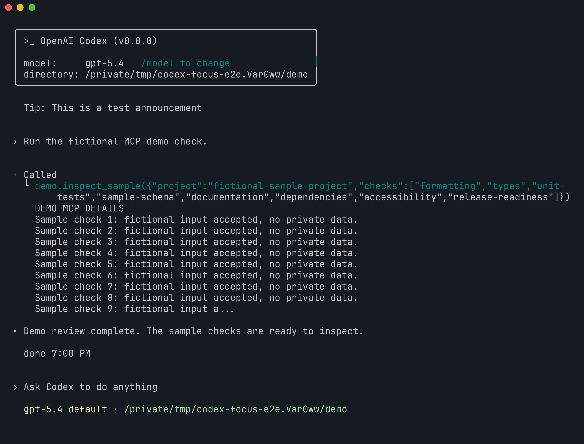
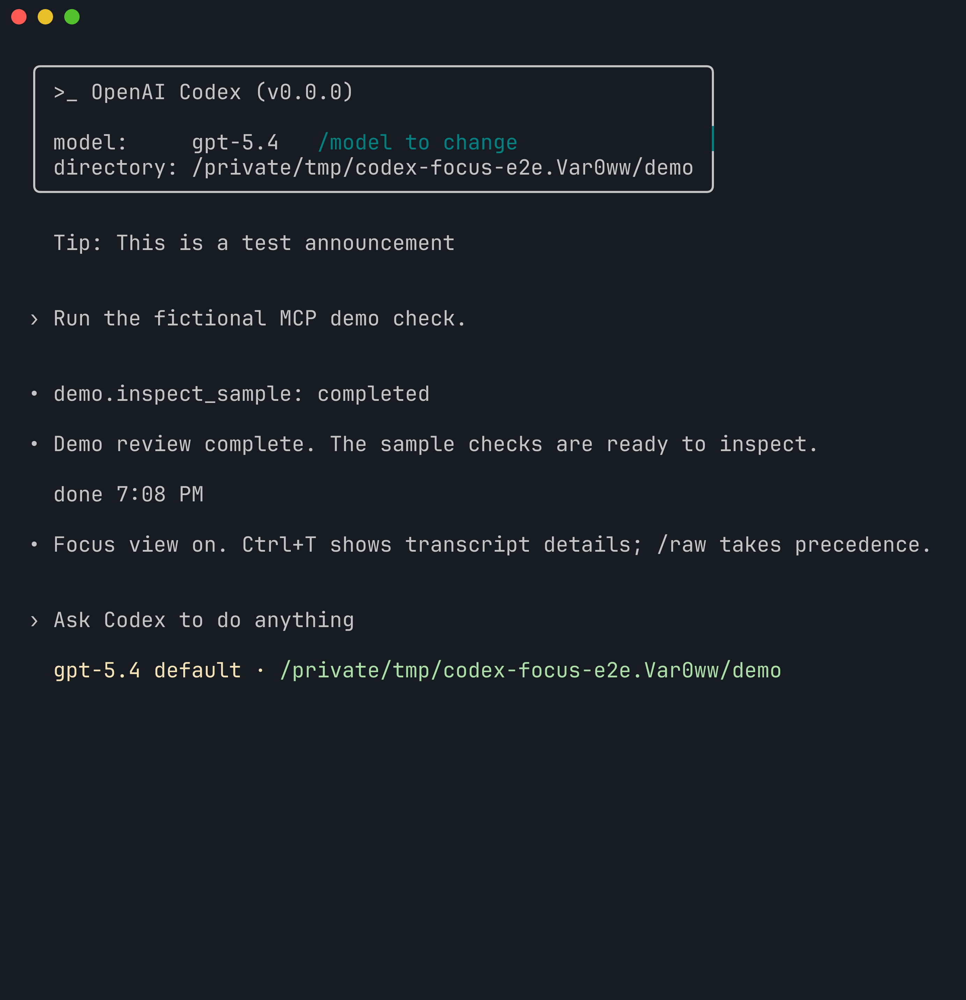

# Focus demo

Real Codex CLI terminal captures, rendered from tmux ANSI output with Freeze.
Both views use the same binary, conversation and 110-by-36 terminal; `/focus`
changes the existing transcript's presentation.

All responses and MCP results come from local synthetic fixtures. No account,
API key, private project or real model was used. The displayed model name is a
fixture label.

| Focus off | Focus on |
| --- | --- |
|  |  |

These assets live on an evidence-only branch and are not part of the code PR.
